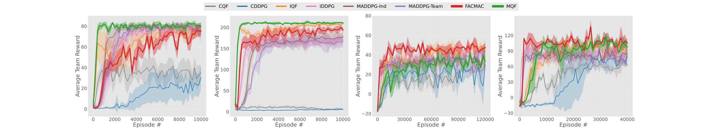
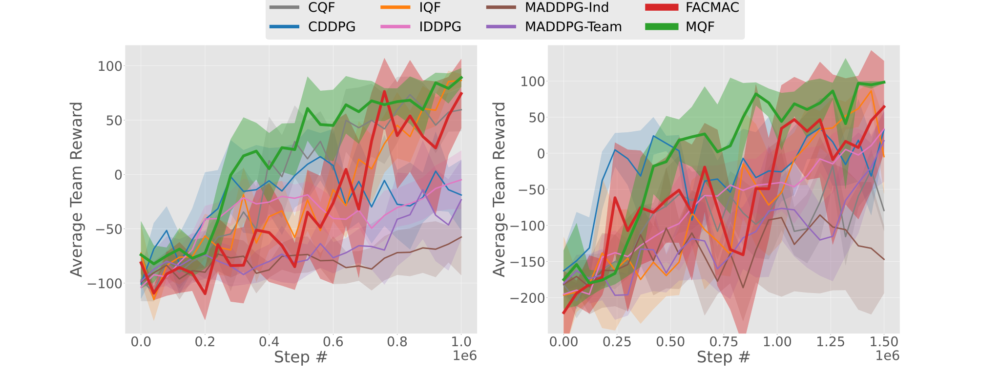

# Mixed Q-Functionals: Advancing Value-Based Methods in Cooperative MARL with Continuous Action Domains

This repository contains the analysis scripts of Mixed Q-Functionals: Advancing Value-Based Methods in Cooperative MARL with Continuous Action Domains. 


## Requirements

To install requirements:

```setup
pip install -r requirements.txt
```

## Structure

Under the main directory, there are two notebooks: (i) fig-1 and (ii) fig-2, which generate the respective figures presented in the paper.

**MPE Results:** (a) 2A2L, (b) 5A5L, (c) S-PP, (d) IC-PP, respectively.




**MWE Results:** (a) 2A1W, (b) 4A2W, respectively.

<div align="center">

</div>
In the main folder, each experiment folder, named after its respective scenario, can be found; it includes the data (rewards, hyperparameters, etc.) and a notebook file for generating the result figures in the appendix.


## Contributions

The key contributions can be summarized as: 

- We introduce Mixed Q-Functionals (MQF) and two baseline methods (Independent Q-Functionals and Centralized Q-Functionals), as novel _value-based_ approaches for multi-agent tasks with continuous action domains.
    

- Our research is the first, to the best of our knowledge, to demonstrate the advantages of _value-based_ over _policy-based_ methods in cooperative MARL with continuous action spaces, revealing new possibilities for _value-based_ strategies.


- Our comparative analyses demonstrate that MQF not only consistently outperforms DDPG-based methods but also matches or surpasses the performance of FACtored Multi-Agent Centralized policy gradients (FACMAC) --an advanced _policy-based_ method designed to enhance sample efficiency-- in similar settings, achieving optimal solutions and exhibiting faster convergence in five different scenarios. 


## Training

For the code to train the models, please refer to the other [repository](https://drive.google.com/drive/folders/1ITibXQsn3gix3YCPUNEBPU00Cr1aWont). 
There, you will find implementations for each algorithm, along with the necessary guidelines for training the models.  


## ToDos

- Share the latest trained models for the algorithms.


